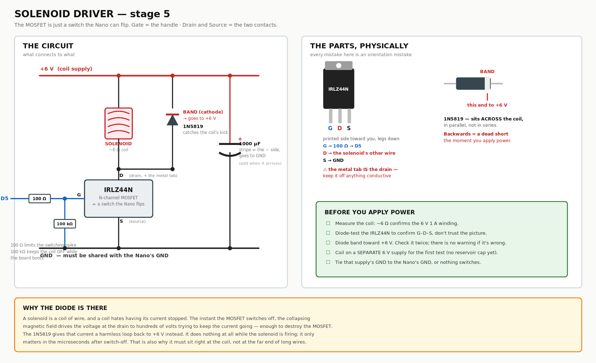
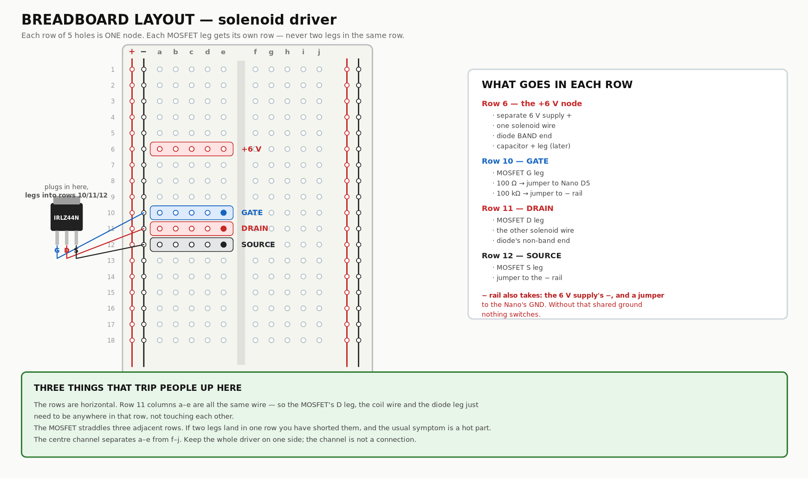

# BENCH_BUILD.md — building from the MT3608 forward, with the parts on hand

Everything downstream of the charger, using only what has been delivered. The TP4056 hasn't
arrived, so the cell can't be recharged yet — this guide works around that by running the bench
off the ELEGOO supply and the RoomCleaner 12 V rig, and saving the LiPo for the tests that
actually need it.

**Bench wiring diagram: `renders/electrical/bench_wiring_esp32.png`** — exactly what to connect
now, on this board.

Full-system reference: [`WIRING.md`](WIRING.md) · diagram: `renders/electrical/wiring_diagram.png`
Firmware: `firmware/rfid_bike_lock_rc522/`

---

## 0. What you have, what's missing, and the workaround

| Needed | Status | Workaround until it arrives |
|---|---|---|
| MT3608 boost | ✅ delivered | — |
| HS-0730B solenoid, 6 V 1 A | ✅ delivered | — |
| IRLZ44N, 1N5819 | ✅ delivered | — |
| IRF4905 (P-FET reader gate) | ✅ delivered | use instead of the AO3401 — same circuit, TO-220 package |
| 103450 LiPo | ✅ delivered | ships part-charged (~3.7–3.8 V). **You cannot recharge it yet**, so use it only for stages 5–6 |
| **Arduino Nano ESP32**, RC522, buttons, LEDs, buzzer, resistors | ✅ owned | 3.3 V board — see the note below |
| **TP4056** | ❌ not ordered | none — the cell simply can't be recharged. Don't run it below 3.0 V |
| **AMS1117-3.3** | ❌ not ordered | the ELEGOO supply module's **3.3 V rail** powers the RC522 on the bench |
| **1000 µF cap** | ❌ not ordered | drive the coil from a *separate* supply in stage 5 so rail dips can't reset the Nano |

### The board is a Nano ESP32, which changes two stages

It is a **3.3 V** board, so the RC522 connects **directly — no level shifters, no AMS1117**.
That deletes eight resistors and one missing part from this build. Its VIN range is 6–21 V, so
the 6.2–6.5 V rail is valid (near the bottom, which is fine). Flash
`firmware/rfid_bike_lock_esp32/` — the AVR sketches will not compile on it. Board support:
Boards Manager → "Arduino ESP32 Boards" → *Arduino Nano ESP32*.

The board's **5 V pin is disabled behind a solder jumper and fed from USB only**. Leave it
alone; nothing in this design needs 5 V any more.

**Two rules for the whole session.** Set the MT3608's output *before* connecting anything to
it — they ship at 20 V and will kill the Nano. And the 1N5819's painted band goes to the
**positive** rail; backwards it is a dead short.

---

## Stage 1 — set the MT3608 to 6.2–6.5 V (10 min)

Nothing else connected. Feed it 5 V from the ELEGOO module (or 12 V from the RoomCleaner PSU
through an MP1584 — the MT3608 takes 2–24 V in).

1. IN+ / IN− to the supply. Multimeter on OUT+ / OUT−.
2. Turn the trim pot. Many turns do nothing at first; keep going, then it climbs fast.
3. Land on **6.2–6.5 V** (not 6.0: the Nano's regulator needs ~1.1 V of dropout). Power down.

Mark the module with tape so you don't confuse it with the other four in the pack, and put a
dot of nail polish or hot glue on the pot so vibration can't drift it.

> **Why not exactly 6.0?** The Nano's onboard AMS1117-5.0 drops about 1.1 V, so a 6.0 V rail
> leaves its 5 V output sagging near 4.9. 6.2–6.5 gives a solid 5 V for the reader and LEDs,
> and only pushes the 6 V solenoid ~7% over rating — irrelevant for a 300 ms pulse.


---

## Stage 2 — Nano on the 6 V rail (10 min)

| From | To |
|---|---|
| MT3608 OUT+ | Nano **VIN** |
| MT3608 OUT− | Nano **GND** |

| Measure | Expect |
|---|---|
| Nano **3V3** pin → GND | 3.25–3.35 V (its onboard regulator working) |
| VIN → GND | 6.2–6.5 V |

If the 3V3 pin reads 6 V you're on the wrong pin, and that would destroy the reader.

---

## Stage 3 — panel I/O, no reader yet (30 min)

This proves the sketch, the buttons, the LEDs and the buzzer before any reader complexity.

| Part | Nano pin | Wiring |
|---|---|---|
| GREEN button | D3 | one leg → D3, other leg → GND |
| RED button | D2 | same |
| Red LED | D8 | anode → **220 Ω** → D8, cathode → GND |
| Green LED | D9 | same on D9 |

⚠️ **220 Ω, not 470.** The 470 Ω figure was sized for a 5 V board; on 3.3 V it passes about
2.5 mA and the LEDs look dim.
| Active buzzer | D6 | (+) → D6, (−) → GND |

Flash `firmware/rfid_bike_lock_rc522/`. Install the **MFRC522** library first (Library Manager,
by GithubCommunity). Serial monitor at 115200.

**Expect:** press green → short chirp, `[wake]` on serial, then a fast red ×5 and a long buzz
because no reader answers. That failure *is* the pass condition for this stage — it means
buttons, LEDs, buzzer and the state machine all work.

Tap red during the window → one red blink, a 150 ms beep, back to sleep.

---

## Stage 4 — RC522 (15 min)   ✅ **PASSED 2026-09-07** — master fob enrolled

*If the reader misbehaves, flash `firmware/rc522_test/` first: 40 lines that print VersionReg
and any card UID, so you find the fault in one upload instead of guessing inside 440 lines of
lock firmware.*


Both parts are 3.3 V, so this is now seven wires and nothing else. **No dividers, no AMS1117,
no ELEGOO rail.**

| RC522 | Nano ESP32 |
|---|---|
| SDA (SS) | D10 |
| SCK | D13 |
| MOSI | D11 |
| MISO | D12 |
| RST | D4 |
| 3.3V | **3V3 pin** |
| GND | GND |

**Expect:** green button → chirp → tap a fob → `[scan] uid=…`. The first fob ever tapped
becomes master and is written to EEPROM. A second fob gives two red blinks and a long buzz.
Hold red 5 s → three beeps → tap master → tap the second fob → it enrolls, green ×3.

If you get the fast red ×5: check SS and RST first, then that 3.3 V is actually present at the
module, then that the dividers aren't swapped.

---

## Stage 5 — solenoid driver (45 min)



*Circuit and physical parts side by side: `renders/electrical/driver_card.png`*



*Row-by-row breadboard layout: `renders/electrical/breadboard_driver.png`*


Build the driver on a scrap of perfboard for now; cut the final 42 × 10.7 card later.

```
coil supply + ──┬──────────── solenoid ──── IRLZ44N drain
                │                 │
            (cap later)        1N5819   band toward +
                │                 │
coil supply − ──┴── IRLZ44N source ┴── GND, common with the Nano
Nano D5 ── 100 Ω ── IRLZ44N gate ── 100 kΩ ── GND
```

**Power the coil from a separate 6 V source for this first test** — the RoomCleaner 12 V PSU
through an MP1584 set to 6 V is ideal. Without the reservoir cap, a 1 A pulse on a shared rail
can dip it enough to reset the Nano, and you'd waste an hour chasing a fault that isn't there.
Grounds still tie together.

| Measure | Expect |
|---|---|
| Coil resistance before wiring | ~6 Ω (confirms the 6 V 1 A winding) |
| Across the coil, idle | 0 V |
| Across the coil during the 300 ms pulse | 5.5–6 V |
| Gate at D5 during the pulse | ~5 V |

**Expect:** an authorized fob → clunk. File the plunger's 45° nose before testing the latch
itself; for now you're only proving the electrical path.

If the pull feels weak, try `SOLENOID_PULSE_MS = 150` — shorter is fine, the plunger moves in
tens of milliseconds — and check you're at 6 V, not 5.

---

## Stage 6 — reader power gate (20 min) — OPTIONAL on this board

⚠️ **Skip this stage for now.** `READER_POWER_GATED` is 0 in the ESP32 sketch, so the reader
stays powered. The IRF4905 is a poor fit here: its gate threshold is −2 to −4 V and 3.3 V logic
can only reach −3.3 V, so it may never turn fully on or off. Do stage 7 first — if the sleep
current is acceptable without gating, you may not need this at all. When you do want it, use
the logic-level **AO3401** from the SOT-23 kit and set `READER_POWER_GATED` to 1.

<details><summary>Original IRF4905 wiring, for reference</summary>

The IRF4905 is a P-channel in TO-220. Facing the printed side with the legs down: **G – D – S**.
The metal tab is connected to the drain, so it sits at the load's voltage — keep it off
anything conductive.

| IRF4905 | To |
|---|---|
| **S** (source) | Nano 5V pin |
| **D** (drain) | reader supply (the AMS1117's input when it arrives; the RC522 directly for now, **only if you keep it on 3.3 V** — see note) |
| **G** (gate) | Nano D7, plus a 10 kΩ from gate to 5 V |

⚠️ **Do not feed the RC522 from the 5 V drain.** Until the AMS1117 arrives, leave the reader on
the ELEGOO 3.3 V rail and test the gate with an LED and resistor on the drain instead: D7 low →
LED on, D7 high → LED off. That proves the gate logic without risking the module.

| Measure | Expect |
|---|---|
| Drain to GND, D7 driven LOW | ≈ 5 V (FET on) |
| Drain to GND, D7 HIGH | ≈ 0 V (FET off) |

If it's backwards — on when it should be off — source and drain are swapped.
</details>

---

## Stage 7 — the sleep-current test (15 min, needs the LiPo)

This is the one that decides whether the lock lasts weeks or days. Now switch the MT3608's
input to the **LiPo**, since a bench supply's own draw would swamp the reading.

Meter in series with the cell's positive lead, sketch running, let the scan window expire.

⚠️ **The Nano ESP32 is not a low-power board.** Its USB bridge, RGB LED and regulator all draw
current in deep sleep, and published figures are milliamps rather than the microamps a bare
ESP32-S3 reaches. This measurement is therefore a genuine unknown, not a pass/fail against a
number I can promise you.

| Reading | Meaning |
|---|---|
| under 1 mA | excellent — months per charge |
| 1–5 mA | workable — days to weeks; matches the original design budget |
| 10 mA + | the board's own overhead dominates. Not a firmware bug. The fix is a bare ESP32-S3 module or a 3.3 V Pro Mini, both drop-in for this circuit |

Comment out `#define DEBUG` for this test; USB serial keeps the bridge awake.

**Watch the cell voltage.** You can't recharge until the TP4056 arrives, so stop at 3.4 V and
leave the rest for later.

---

## When the missing parts arrive

1. **TP4056** — cell to B+/B−, then OUT+/OUT− becomes the input to the MT3608. The cell is
   never tapped by anything else. Charge with the lock asleep; this board has no load sharing.
2. **AMS1117-3.3** — not needed any more on a 3.3 V board. If you later gate the reader's
   supply, use the **AO3401** from the SOT-23 kit: the IRF4905's −2 to −4 V threshold is
   marginal when 3.3 V logic can only pull its gate to −3.3 V.
3. **1000 µF (Ø8 × 12.5, or Ø10 up to 20 mm — both fit the driver card)** — across the coil
   supply, right at the card. Then move the coil onto the shared 6 V rail and re-run stage 5.
