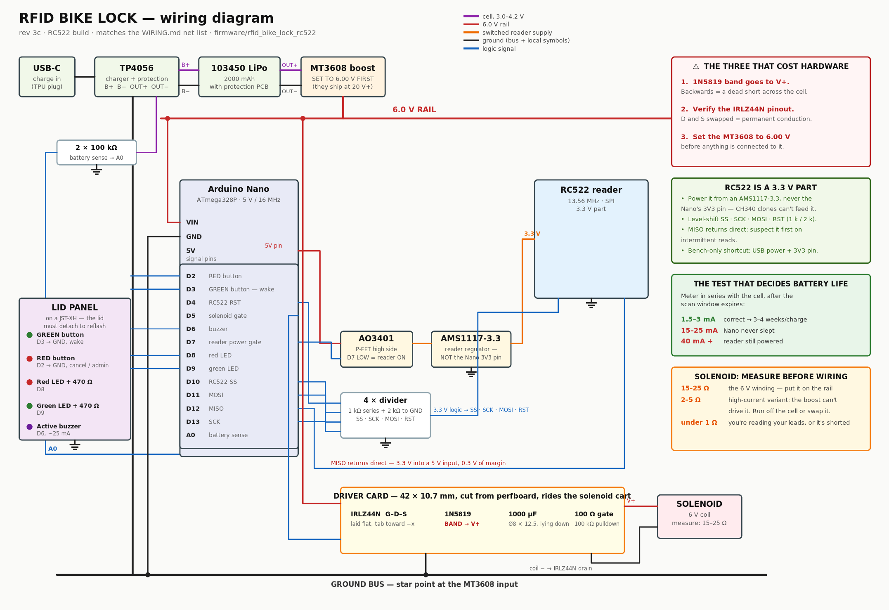
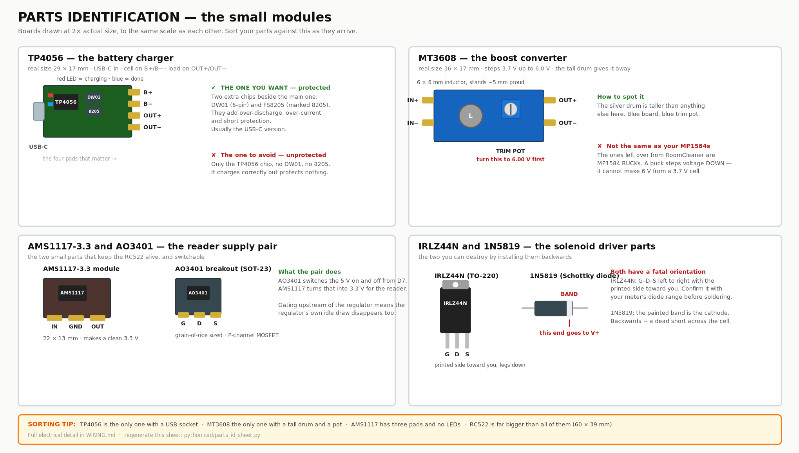

# WIRING.md — the electrical build, in detail



*Full-size: [`renders/electrical/wiring_diagram.png`](renders/electrical/wiring_diagram.png) · vector:
[`.svg`](renders/electrical/wiring_diagram.svg) · regenerate with `python cad/wiring_diagram.py`*

Everything electrical for the rev 3c lock: what connects to what, why it is arranged that
way, the order to solder it in, and what to measure at each step. Mechanical assembly is in
[`ASSEMBLY_CNC.md`](ASSEMBLY_CNC.md); this file is the companion for the wiring.

Firmware referenced throughout: `firmware/rfid_bike_lock_rc522/` (RC522 build).

---

## 0. Know your parts before you wire them



⚠️ **A 2S/3S charger is not a TP4056.** Boards sold as "2S 2A boost converter 8.4 V / 12.6 V /
16.8 V charging protection" charge **multi-cell packs**: 8.4 V is two cells in series, 12.6 V
is three, 16.8 V is four. This lock runs **one** 103450 cell that must never see more than
**4.2 V**. Putting a single cell on an 8.4 V charger drives it far past its limit — that is
the failure mode that vents and burns. If you have one of these, set it aside for a 2S
project and order a TP4056.

| | TP4056 (what you need) | 2S/3S boost charger (not this) |
|---|---|---|
| Charges | one cell to 4.2 V | packs of 2–4 cells to 8.4 / 12.6 / 16.8 V |
| Silkscreen | "TP4056" on the main chip | "2S", "3S", "8.4V", "12.6V" |
| Board | 29 × 17 mm, flat, two LEDs | larger, usually with an inductor |

---

## 1. Architecture — three power domains

```
   USB-C ──► TP4056 ──► 103450 LiPo (3.0–4.2 V)  ── the CELL domain
                              │
                              ├──────────────► MT3608 boost ──► 6.0 V  ── the RAIL domain
                              │                                   │
                              │                          ┌────────┴────────┐
                              │                          │                 │
                              │                    Nano VIN          solenoid +
                              │                   (AMS1117 → 5 V)         │
                              │                          │            IRLZ44N ◄── D5
                              │                          │
                              │                    AO3401 ◄── D7
                              │                          │
                              │                    AMS1117-3.3
                              │                          │
                              │                     RC522 3.3 V  ── the READER domain
                              │                                     (dead when D7 is HIGH)
                              └── 100 kΩ / 100 kΩ divider ──► A0
```

Why it is split this way:

- **The reader domain is switchable.** An RC522 idles around 15–26 mA, which would flatten
  the cell in days. D7 kills its supply completely between scans, and killing it *upstream of
  the regulator* means the regulator's own quiescent draw goes too.
- **The solenoid sits on the rail, not on the logic.** It shares the 6 V node with the Nano
  but has its own path back to ground so its 300 mA pulse does not travel through logic
  ground wiring.
- **The cell domain is the only place with real energy.** Everything downstream is fused by
  the cell's own protection PCB.

---

## 2. Complete net list

Every wire in the lock. If it is not on this list, it should not exist.

### 2.1 Power

| From | To | Wire | Notes |
|---|---|---|---|
| Cell + (red) | TP4056 **B+** | 22 AWG | JST-PH pigtail if the cell has one |
| Cell − (black) | TP4056 **B−** | 22 AWG | |
| TP4056 **OUT+** | MT3608 **IN+** | 22 AWG | |
| TP4056 **OUT−** | MT3608 **IN−** | 22 AWG | this is system ground, star point |
| TP4056 **OUT+** | 100 kΩ → A0 | 26 AWG | battery sense, top of the divider |
| A0 | 100 kΩ → GND | 26 AWG | bottom of the divider |
| MT3608 **OUT+** | Nano **VIN** | 22 AWG | 6.00 V |
| MT3608 **OUT+** | driver card **V+** | 22 AWG | solenoid supply |
| MT3608 **OUT−** | Nano **GND** | 22 AWG | |
| MT3608 **OUT−** | driver card **GND** | 22 AWG | separate wire, not daisy-chained through the Nano |
| Nano **5V** | AO3401 breakout **IN** | 24 AWG | reader domain feed |
| AO3401 **OUT** | AMS1117-3.3 **IN** | 24 AWG | |
| AMS1117-3.3 **OUT** | RC522 **3.3V** | 24 AWG | |
| AMS1117 **GND**, RC522 **GND** | system GND | 24 AWG | |

### 2.2 Signals

| Nano pin | To | Series part | Notes |
|---|---|---|---|
| D2 | RED button → GND | — | internal pullup; tap = cancel, hold 5 s = admin |
| D3 | GREEN button → GND | — | INT1, the **only** wake source |
| D4 | RC522 **RST** | 1 kΩ / 2 kΩ divider | see §3 |
| D5 | driver card **GATE** | 100 Ω | 100 kΩ pulldown on the card |
| D6 | buzzer **+** | — | active buzzer, ~25 mA |
| D7 | AO3401 **gate** | 10 kΩ pullup to 5 V | LOW = reader on |
| D8 | RED LED **anode** | 470 Ω | |
| D9 | GREEN LED **anode** | 470 Ω | |
| D10 | RC522 **SDA/SS** | 1 kΩ / 2 kΩ divider | |
| D11 | RC522 **MOSI** | 1 kΩ / 2 kΩ divider | |
| D12 | RC522 **MISO** | direct | reader drives this, see §3 |
| D13 | RC522 **SCK** | 1 kΩ / 2 kΩ divider | |
| A0 | battery divider | — | |

---

## 3. The RC522 voltage problem — read before wiring

This is the single most common way to kill an RC522, so it gets its own section.

**The module is a 3.3 V part.** Its VCC pin must see 3.3 V, and its logic inputs are rated to
3.3 V. The Nano is a 5 V part driving 5 V logic. Three consequences:

**a) Do not power it from the Nano's 3V3 pin.** On a CH340 clone that pin is either fed by a
tiny regulator good for ~50 mA, or on some clones it is not connected to anything useful at
all when the board is running off VIN rather than USB. The RC522 pulls up to 26 mA in bursts
and browns out. **Use a proper AMS1117-3.3 module** fed from the switched 5 V.

**b) Level-shift the four inputs.** SS, SCK, MOSI and RST are driven by the Nano at 5 V. The
cheap, reliable fix is a resistor divider on each: 1 kΩ in series, 2 kΩ to ground, giving
3.3 V at the module pin.

```
Nano D13 ──[1 kΩ]──┬── RC522 SCK
                   │
                 [2 kΩ]
                   │
                  GND        (same pattern for D10→SS, D11→MOSI, D4→RST)
```

Eight resistors total. A 4-channel level shifter module does the same job if you have one.

**c) MISO goes back direct.** The RC522 drives it at 3.3 V. The Nano's logic-high threshold
at 5 V supply is 3.0 V, so 3.3 V reads as HIGH — with only 0.3 V of margin. It works, and
essentially every RC522-on-Uno tutorial relies on it, but if you get intermittent read
failures after everything else checks out, this is the suspect.

**On the bench you can skip all of this** by running the Nano from USB 5 V and the RC522 from
the 3V3 pin, which is what most tutorials do. It survives because USB supplies plenty and the
runs are short. Do not carry that shortcut into the sealed box.

---

## 4. Which solenoid you got decides the wiring

**Measure the coil resistance with a multimeter before wiring anything.** Two leads, ohms
range, across the solenoid's terminals. What you read decides the circuit:

| Reading | What it is | How to wire it |
|---|---|---|
| **15–25 Ω** | the 6 V / ~300 mA winding this design assumes | **Solenoid on the 6 V rail.** The MT3608 (2 A) supplies it comfortably, full rated force |
| **2–5 Ω** | a high-current variant (1.5–3.4 A) | The boost **cannot** do this. Run the coil straight off the cell, accept ~60 % force, and expect the cell's protection to trip if it is a 3.4 A unit. Better: return it and get the 6 V one |
| **under 1 Ω** | you are measuring your leads, or the coil is shorted | re-check with the leads touching first, subtract that |

The rest of this document assumes the 15–25 Ω case.

**About the reservoir capacitor.** 1000 µF at 6 V holds about 1 mC of usable charge; the
300 ms pulse needs 90 mC. So the cap does **not** power the pulse — the boost does. The cap
is there to absorb the switching transient at turn-on and to keep the rail from dipping
sharply enough to reset the Nano. It is doing a real job, just not the one it is often
credited with.

---

## 5. The driver card

A 42 × 10.7 mm rectangle cut from your perfboard, which is about **16 × 4 holes** at 0.1"
pitch. It rides on the solenoid cart so the switching sits under 30 mm from the coil.

### 5.1 What goes on it

| Part | Placement |
|---|---|
| IRLZ44N | **laid flat**, tab toward the −x end, legs bent 90° into the board |
| 1N5819 | across the coil terminals, **band toward V+** |
| 1000 µF Ø8 × 12.5 | **lying down** along the card, leads bent 90° |
| 100 Ω | gate series, D5 to gate |
| 100 kΩ | gate to source (pulldown) |

### 5.2 Layout, row by row

Hold the card with the 42 mm dimension horizontal and 4 rows top to bottom:

```
row 1  ┌────────────────────────────────────────────┐
       │  V+ rail  ●━━━━━━━━━━━━━━━━━━━━━━━━━━━━●    │  ← V+ from MT3608, and to coil +
row 2  │   [1000 µF lying]        [1N5819 →|]       │
row 3  │   IRLZ44N flat:  G  D  S                   │  ← D to coil −, S to GND
row 4  │  GND rail ●━━━━━━━━━━━━━━━━━━━━━━━━━━━●    │  ← GND from MT3608
       └────────────────────────────────────────────┘
          [100 Ω] from D5 to G,  [100 kΩ] from G to GND
```

Build the two rails first as bare tinned-wire runs along rows 1 and 4 — they carry the pulse
current and a solder trace alone is not enough.

### 5.3 The two mistakes that cost hardware

1. **1N5819 backwards.** The band (cathode) goes to **V+**. Reversed, it conducts the moment
   you apply power: a dead short across the cell, through a Schottky diode that will not
   survive it. Check it twice; it is the one error with no warning.
2. **IRLZ44N pinout assumed.** Facing the printed side, legs down, it is **G–D–S** left to
   right. Getting D and S swapped puts the body diode across the supply, which conducts
   permanently. Confirm with the diode-test range before soldering.

---

## 6. Build order, with what to measure

Do not skip the measurements. Each one catches a specific failure before it can propagate.

### Step 1 — power chain alone, no logic

Wire only: cell → TP4056 → MT3608. Nothing on the output.

| Measure | Expect |
|---|---|
| TP4056 OUT+ to OUT− | cell voltage, 3.4–4.2 V |
| MT3608 OUT+ to OUT−, adjusting the pot | sweeps well past 6 V |
| Set it and re-measure | **6.00 V ± 0.05** |

**Then power down before connecting anything.** An MT3608 shipped at 20 V+ will destroy the
Nano in the time it takes to notice.

### Step 2 — Nano alone on the rail

6 V to VIN, ground to GND. Nothing else.

| Measure | Expect |
|---|---|
| Nano 5V pin to GND | 4.9–5.1 V (its AMS1117 working) |
| Nano 3V3 pin | ignore this pin, we are not using it |
| Current into VIN | 15–25 mA with the sketch running, before sleep |

### Step 3 — reader domain

Add the AO3401 breakout, the AMS1117-3.3, the four dividers, and the RC522.

| Measure | Expect |
|---|---|
| AMS1117 OUT, D7 driven LOW | 3.25–3.35 V |
| AMS1117 OUT, D7 HIGH or floating | under 0.1 V — if it stays up, the P-FET is in backwards |
| RC522 SCK pin while idle | around 0 V; scope or meter on the divider midpoint reads ~3.3 V when driven |

Flash the firmware. Green button → chirp, `[wake]` on serial, fob tap prints a UID.

### Step 4 — solenoid stage

Add the driver card and coil. **Do this on a bench supply first if you have one**, current
limit 500 mA.

| Measure | Expect |
|---|---|
| Coil resistance, before wiring | 15–25 Ω (see §4) |
| Across the coil, idle | 0 V |
| Across the coil during the 300 ms pulse | 5.5–6 V |
| Rail during the pulse | should not dip below 5.5 V |

If the Nano resets when it fires: grounds are not properly common, or the driver card's
ground goes through the Nano instead of back to the MT3608.

### Step 5 — sleep current, the real test

Meter in series with the cell, sketch running, let the scan window expire.

| Reading | Meaning |
|---|---|
| **1.5–3 mA** | correct — MT3608 quiescent plus the Nano's leaks |
| 15–25 mA | the Nano never slept. Usual causes: a button wired to the wrong pin so D3 is held low, or `#define DEBUG` left in keeping serial alive |
| 40 mA+ | the reader is still powered — D7 logic or the P-FET orientation |

At 2.5 mA the 2000 mAh cell lasts roughly **three to four weeks** per charge. That number is
the whole reason the reader is gated.

---

## 7. Harness, physically

Approximate run lengths inside the box, from the stack-up:

| Run | Length | Gauge |
|---|---|---|
| Battery leads to TP4056 | 60 mm | 22 AWG |
| TP4056 to MT3608 | 25 mm | 22 AWG |
| MT3608 to Nano VIN/GND | 40 mm | 22 AWG |
| MT3608 to driver card | 45 mm | 22 AWG |
| Driver card to coil | **25 mm — keep it short** | 22 AWG |
| Reader to Nano, 6 wires | 45 mm | 26 AWG ribbon |
| Lid loop: 2 buttons, 2 LEDs, buzzer | 90 mm with slack | 26 AWG |

**Connectorize the lid loop with a JST-XH.** The lid has to come off for reflashing, and a
soldered lid loop means desoldering five wires every time. Everything else can be soldered
direct.

Leave a service loop on the battery leads. The cell is the part most likely to be replaced.

---

## 8. Failure table

| Symptom | Check in this order |
|---|---|
| Nothing at all, no serial | MT3608 output voltage; then VIN vs 5V pin |
| Serial works, reader not found (fast red ×5) | SS and RST pin assignment · module header actually soldered · 3.3 V present at the module · dividers not swapped |
| Reader found, never reads a fob | antenna side facing the tag · fob is 13.56 MHz not 125 kHz · MISO margin (§3c) |
| Reads on the bench, not in the box | distance to the lid · anything metal near the antenna · reader supply sagging under the box wiring |
| Solenoid silent | coil resistance · gate voltage at D5 during the pulse (should be ~5 V) · MOSFET pinout |
| Solenoid weak | wrong winding (§4) · rail dipping · plunger binding mechanically, not electrical |
| Nano resets on unlock | grounding topology · reservoir cap missing or on the wrong node |
| Battery drains in days | sleep current test, §6 step 5 |
| Charging never completes | TP4056 has no load sharing — charge with the lock asleep |

---

## 9. Honest gaps

- **The firmware has never run on hardware.** Section 6 is the first time it will.
- **No cable-state sensor.** An authorized tap pulses the solenoid whether or not the cable
  head is in the latch. Harmless, but the lock cannot tell you it is locked.
- **No load sharing on the TP4056.** Charging while awake confuses termination. A v2 fix is a
  load-sharing P-FET between charger and load.
- **UID matching only.** UIDs are cloneable with cheap hardware. Real security needs
  challenge–response, which needs a different tag type and more firmware.
