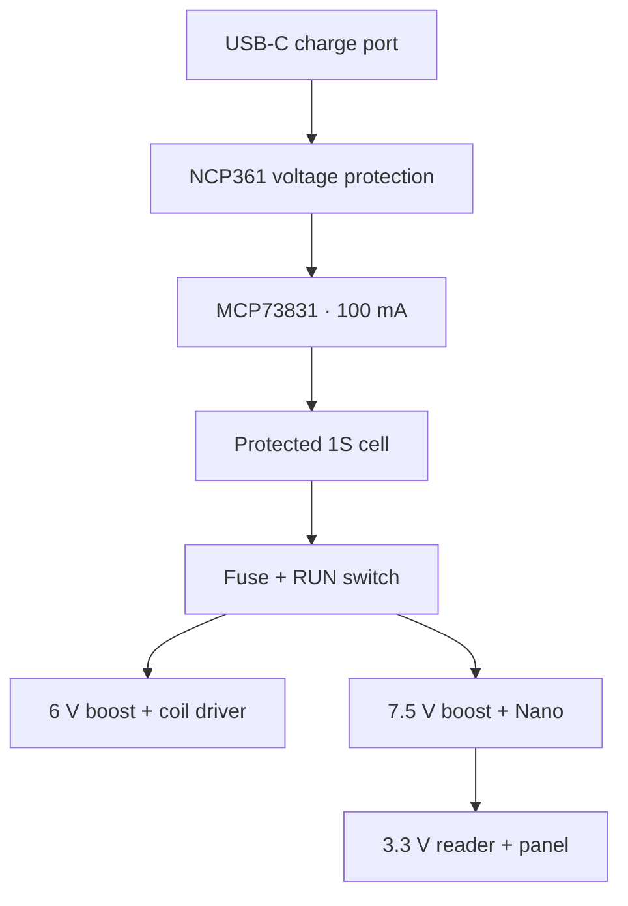

# VELOX carrier Rev B

**Schematic and placement review. NOT FOR FABRICATION, INSTALLATION OR ENCLOSURE RELEASE.**

Rev B targets a tidier **90 × 55 × 1.6 mm** carrier, about **31% less board area**
than the 110 × 65 mm Rev A. It retains the **Arduino Nano ESP32 ABX00083**, remote RC522,
and firmware pin assignments. It is a practical module-based prototype for learning
PCB design and hand assembly; standby current and minimum possible size are not optimized yet.

The earlier workspace became unavailable during final routing. This recovered package
contains the native schematic, exact pin map, candidate BOM, placement map, enclosure
proposal, board-generation source and validation procedure. **It contains no finished
routed Rev B board, Gerbers or approved STEP housing.** Rev A's passing geometric DRC
does not apply to Rev B. Read `review_status.json` for the actual check status.

## What changed

| Area | Rev B proposal | Purpose |
|---|---|---|
| Controller supply | Pololu U3V16F7, nominal 7.5 V, to Nano VIN | Adds margin above Nano's 6 V VIN minimum |
| Solenoid supply | Separate Pololu U3V40F6, nominal 6 V | Keeps coil voltage independent of controller supply |
| Charger | MCP73831-2ATI/OT, onboard, 100 mA default | Replaces a loose charger module and reduces charging heat |
| USB input | Power-only USB-C, two 5.1 kΩ CC resistors, NCP361 OVP | Defined charging input and voltage protection |
| Module mounting | Defined Pololu pin geometry; removable Nano sockets | Removes guessed clone interfaces; supports service |
| External wiring | One XH reader harness, one PH panel harness, XH coil pair | Fewer leads, distinct reader/panel connector families |
| Coil and buzzer | AO3400A low-side MOSFETs; 330 Ω gate resistors and 100 kΩ pull-downs | GPIO controls the load without supplying load current |
| Decoupling | Defined radial capacitor cases, larger USB/charger ceramics | Controls physical size and records effective-capacitance requirements |
| Mechanical layout | Carrier offset and rotated reader proposal | Leaves modeled battery/solenoid regions and screw access available for review |

The PCB consolidates wiring, driver circuits, LED resistors, sensing and charging.
It does not replace the Nano firmware, RFID antenna, battery protection or solenoid.

## Power map

**Charge with RUN OFF and the Nano programming USB unplugged.**
There is no concurrent-use power path, USB emergency unlock, cell temperature sensor,
or onboard battery BMS. The MCP73831 is a charger; the NCP361 protects the USB input.
Neither replaces cell overcharge, overdischarge and discharge-short protection.
If the old TP4056 module supplied the only protection for a bare cell, removing it
requires a qualified protection stage or protected battery before this design can proceed.
Use the protected battery's output positive and output negative, not raw cell tabs.

The 100 mA charge default uses a 10 kΩ PROG resistor. It trades charging speed for
lower dissipation. Increase it only after verifying the cell's charge rating and thermal
behavior in the enclosed box. No charge time is specified without battery capacity.

## Open and regenerate

- Open `design/VELOX_carrier_B.kicad_sch` in KiCad 7 or newer. Embedded symbols are included.
- `previews/placement_plan.svg` shows placement, **not routed copper**.
- `design_spec.json` is the editable source for the component map and nominal placement.
- Run `node regenerate_schematic.mjs` after source changes.
- In an environment with KiCad's `pcbnew`, run `python build_board.py` to generate
  `design/VELOX_carrier_B.kicad_pcb` as an **unrouted** board.
- The builder needs the official KiCad footprint libraries, especially the USB4125
  footprint. Available standard footprint copies are included. Custom Nano/Pololu/wire-pad
  footprints are generated from the recorded geometry. Their nominal positions are
  not a guarantee that real headers and sockets will mate.
- After routing, run `python validate_after_routing.py`, native full ERC in KiCad,
  and retain the reports. KiCad 7 CLI does not provide ERC; a netlist comparison is not ERC.

The recovered schematic text was independently parsed back into pin/wire/label connections:
**126 connected board pins, 32 nets, zero source-map mismatches**. The four mounting holes
are board items; three external-supply power flags are schematic-only declarations.
**Native loading, ERC, routing DRC and assembly checks have not been completed on this
recovered package.** The Python build and validation scripts still need execution.

## Connector map

| Ref | Interface | Carrier pin assignment |
|---|---|---|
| J1 | Protected 1S battery | 1 protected +, 2 protected − / GND; verify actual pigtail polarity |
| J2 | External latching RUN switch | 1 fused battery, 2 BAT_RUN; open = OFF |
| J3 | USB-C charging only | A9/B9 VBUS, A12/B12 GND, A5 CC1, B5 CC2, S1 shield/GND |
| J4 | Solenoid, XH 2.50 mm | 1 +6 V, 2 switched coil negative |
| J5 | Reader, XH 2.50 mm | 1 SS, 2 SCK, 3 MOSI, 4 MISO, 5 NC, 6 GND, 7 RST, 8 3V3 |
| J6 | Panel, PH 2.00 mm | 1 button GND, 2 LED GND, 3 wake D3, 4 admin D2, 5 red anode, 6 green anode, 7 buzzer +3V3, 8 switched buzzer − |

Panel buttons are normally open to GND. LED cathodes connect to panel GND.
The active buzzer must be rated for 3.3 V and its current must fit the Nano's 3V3 budget.
Reader wiring follows actual silkscreen, not wire color or assumed clone header order.
Choose matching JST housings/terminals and wire sizes; the board headers are not a complete cable kit.

U3 top-view pins, left to right on its lower edge: **EN, VIN, GND, GND, VOUT, VOUT**.
U4 top-view lower pins: **VIN, GND, VOUT**. U4's body is **8.1 mm wide × 13.1 mm tall**
in this orientation. Dimension drawings viewed from the underside must be mirrored.
Carrier holes are proposed Ø1.2 mm with Ø2.0 mm pads for assembly allowance.
Check the real modules, header stack and insulating gap before fabrication.

## Current, voltage and thermal budget

The actual solenoid rating is still unknown. The repository's 6 V/approximately 1 A
bench assumption conflicts with its older 300 mA BOM. These calculations are examples,
not measurements of the installed solenoid.

| Example | Result and implication |
|---|---|
| 7.5 V boost at −4% | 7.2 V before load droop; 1.2 V nominal margin over Nano's 6 V minimum |
| 6 V boost at +4% | 6.24 V; confirm that the actual coil tolerates this rail and pulse duration |
| 6.24 V × 1 A coil + assumed 0.4 W logic, 3.2 V cell, 85% efficiency | About 2.44 A from the battery; inrush and tolerances are additional |
| 470 µF, 1 A, 0.5 V permitted drop | About 0.235 ms of support; this capacitor does not supply a 300 ms unlock pulse |
| 100 kΩ / 100 kΩ battery divider | 2.10 V at the ADC with a 4.2 V battery; calibrate actual ESP32 ADC readings |
| Charger at 5.9 V input, 3.0 V cell and 100 mA | About 0.29 W in the charger before quiescent losses; enclosed thermal verification remains required |

F1 is a **3 A candidate**, not a qualified fuse selection. Match its time-current and
interrupt ratings to measured pulse/inrush, cell protection, switch, wires and connectors.
An existing 2 A pigtail is not automatically acceptable for the example discharge load.
Boost-module input-current advertising does not establish output current at the required
voltage ratio or temperature. Check full charge, low battery, radio activity and repeated unlocks.

C1 is EEUFR1A471 (470 µF/10 V, D8/P3.5/H11.5); C8 is EEUFR1A101
(100 µF/10 V, D5/P2/H11). Exact ceramic MPNs remain open:
C9 must retain at least 1 µF at 20 V; C10 at least 4.7 µF at 5.9 V;
C11 at least 4.7 µF at 4.2 V. Verify USB hot-plug behavior and charger input voltage
with an oscilloscope. OVP threshold tolerance alone does not prove transient compliance.

## Copper and assembly requirements

Two copper layers and nominal 1 oz copper are the prototype target.
The project's proposed defaults are 0.20 mm copper clearance, 0.25 mm signal tracks,
0.50 mm copper-to-edge, and Ø0.9/0.45 mm vias. Fabricator DFM still must approve these.

| Route | Proposed main width |
|---|---|
| Battery positive and main battery return | 1.5 mm |
| Coil supply and Q1 source return | 1.0 mm |
| Nano 7.5 V rail | 0.8 mm |
| USB power | 0.5 mm |
| 3V3 distribution / local logic GND | 0.4 mm |
| Digital signals | 0.25 mm |

Route Q1, D1, C1 and U3 as a compact high-current loop. Use a short, wide Q1-source
return to the coil supply ground region; do not send coil current through the ADC or Nano
ground path. Maintain continuous logic reference copper and the antenna keepout.
Review narrow pad escapes and thermal spokes separately from the nominal main widths.
Place USB/charger decoupling close to the relevant pins. Keep the reader harness and
ADC routing away from coil switching. Ground-pour continuity alone does not prove current capacity.

Choose socket/header MPNs and actual heights. Retain boost modules against vibration
on insulating spacers; solder joints are not mechanical retention. Reserve solder-tail
clearance under the carrier. Assemble board screws before lid harnesses obstruct access.

## Enclosure and installation proposal

`mechanical/enclosure_placement_proposal.json` records the carrier offset, component
height allowances, screw axes, lid-reader rotation and charging-opening concept.
The PCB outline coupon is `mechanical/pcb_outline_fit_coupon.scad`; export STL in
OpenSCAD for a K1/K1 Max fit print. It tests the bare outline and holes only.

Existing enclosure CAD has **not** been updated for the carrier. New standoffs/module
retention, reader mounting and a charging aperture are required. The solenoid clearance
work is retained as an input; this does not certify the complete assembled mechanism.

Before accepting fit, check actual sockets, underside solder pins, connector mates,
battery pigtail, switch, bend radii, cable entry, lid closure, screw-driver approach and
the complete insertion path. Keep wires out of the full latch/solenoid stroke.
The port needs clearance for the actual plug's overmould and a suitable cover/strain relief.
A static bounding-box fit is not an installation proof or an enclosure sealing test.
Verify RFID range with battery, carrier and metal hardware in their final positions.

## Firmware

Use `firmware/rfid_bike_lock_esp32/` and Arduino Nano ESP32 pin names.
D5 controls the coil; D6 the buzzer; D8/D9 LEDs; D2/D3 buttons; D4/D10-D13 reader;
A0 battery sensing. VBUS and boot pins B0/B1 remain unused.
`READER_POWER_GATED=0` matches the always-powered reader.
Bench `DEV_NO_SLEEP` and debug settings must be reviewed before standby-current tests.
Separate boost rails and an always-on reader can dominate sleep consumption.
Battery life is an unmeasured release item, not a promised improvement.

## Release sequence

1. Confirm actual cell/protection, coil, active buzzer, socket/header and USB connector
   variant. Select remaining passive MPNs and a coordinated fuse/switch/wire set.
2. Execute the builders; review native schematic and footprint geometry; complete routing.
   Resolve full ERC, DRC, unconnected pads and footprint errors with retained reports.
3. Update housing/holders; check complete insertion and actual cable mating. Print a
   dimensional fit coupon before the full electronics carrier supports.
4. Prototype with a current-limited supply: continuity/polarity, separate rails, Nano,
   reader and controls, dummy load, then actual coil. Capture droop, switching transients,
   release time, repeated-pulse temperature and charger behavior with RUN off.
5. Verify standby current, low-battery behavior, final assembled RFID range and outdoor
   enclosure protection. Only then export manufacturer-reviewed Gerbers and drill files.

For a plated two-layer prototype, a board fabricator is the intended workflow.
KiCad, a soldering iron, flux, tweezers, magnification, meter and current-limited supply
are sufficient to start; an oscilloscope is needed for the transient checks above.
A K1 prints fit models and holders. Home PCB milling needs a separate DFM/routing revision
because this proposal assumes plated through-holes.

## Primary references

- Nano: https://docs.arduino.cc/resources/datasheets/ABX00083-datasheet.pdf
- Nano pinout: https://docs.arduino.cc/resources/pinouts/ABX00083-full-pinout.pdf
- Coil boost: https://www.pololu.com/product/4013
- Coil boost drawing: https://www.pololu.com/file/0J1844/step-up-voltage-regulator-u3v40fx-dimensions.pdf
- Nano boost: https://www.pololu.com/product/4943
- Nano boost drawing: https://www.pololu.com/file/0J1921/step-up-voltage-regulator-u3v16fx-dimensions.pdf
- Charger: https://ww1.microchip.com/downloads/en/DeviceDoc/MCP73831-Family-Data-Sheet-DS20001984H.pdf
- USB protector: https://www.onsemi.com/pdf/datasheet/ncp361-d.pdf
- USB connector: https://gct.co/files/drawings/usb4125.pdf
- MOSFET: https://www.aosmd.com/res/data_sheets/AO3400A.pdf
- Coil capacitor: https://industrial.panasonic.com/ww/products/pt/aluminum-cap-lead/models/EEUFR1A471
- Input capacitor: https://industrial.panasonic.com/ww/products/pt/aluminum-cap-lead/models/EEUFR1A101

Project-local standard footprints originate from KiCad libraries; their library license
and design-file exception are retained in `design/VELOX.pretty/LICENSE.md`.
Root historical BOM/wiring documents are not the authority for this revision.
